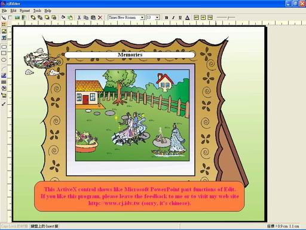



## Likely PowerPoint Editor

### Description

This ActiveX control shows like Microsoft PowerPoint part function of Editing. I think it's very helpful for development visualize program Tool idea (I'm sorry about that the program comments are all chinese).

If you like this program, please leave the feedback to me, thanks.
 
### More Info
 

             |
---                |---
**Submitted On**   |2005-11-11 14:45:24
**By**             |[Chao\-Jen Huang](https://github.com/Planet-Source-Code/PSCIndex/blob/master/ByAuthor/chao-jen-huang.md)
**Level**          |Advanced
**User Rating**    |4.7 (33 globes from 7 users)
**Compatibility**  |VB 6\.0
**Category**       |[OLE/ COM/ DCOM/ Active\-X](https://github.com/Planet-Source-Code/PSCIndex/blob/master/ByCategory/ole-com-dcom-active-x__1-29.md)
**World**          |[Visual Basic](https://github.com/Planet-Source-Code/PSCIndex/blob/master/ByWorld/visual-basic.md)
**Archive File**   |[PowerPoint19475311112005\.zip](https://github.com/Planet-Source-Code/chao-jen-huang-likely-powerpoint-editor__1-63221/archive/master.zip)

